# __Cloud-Native App using AWS Elastic Kubernetes Service__

## __Overview__

This project implements an End-To-End Cloud-Native Voting application using __AWS EKS__ (_Amazon Elastic Kubernetes Services_).

## __Architecture__

<p align="center">
    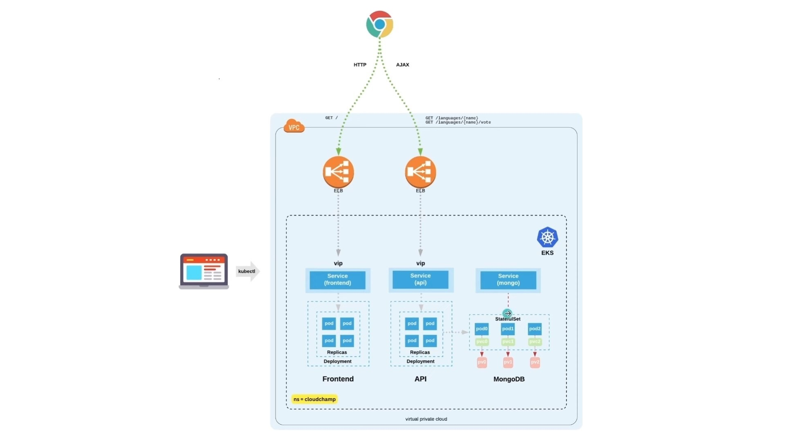
</p>

__Components__:

* __Frontend__: Uses __React__ and __JavaScript__ providing a responsive UI for voting
* __API__: Powered by __Go__ (__Golang__) serving API for voting.
* __Database__: Uses __MongoDB__ configured with replication for redundancy and high-availability.
* __Framework__: Deployed on __Kubernetes__ to maintain a decoupled architecture with independent scaling capability.
    * __Namespaces__: To isolate and organize the different components of the application.
    * __Secrets__: K8s encrypt and store credentials using their built-in standards.
    * __Deployments__: Defines the replication, updation and scaling of the components.
    * __Services__: Provide load-balancing and network routing to instances maintaining optimized performance.
    * __Stateful Sets__: Help retaining the order and identity specifically for databases for persistance.
    * __PersistentVolume and PersistentVolumeClaim__: An application storage with persistance and scalability.

## __Implementation__

### Prerequisites

Before beginning the project, you will need to have an __[AWS](https://docs.aws.amazon.com/streams/latest/dev/setting-up.html)__ set up. If you don't have one, follows the link.

__NOTE__: _This project will cost you some money based on your location._

### Procedure

_Follow the **[Screenshots](./Screenshots/)** for reference!_

1. **Log in to AWS Console:** Open the AWS Management Console with your AWS account credentials.

2. **Create** _**myAmazonEKSCluster**_ **IAM Role :**
   - Follow the steps mentioned in this __[documentation](https://docs.aws.amazon.com/eks/latest/userguide/service_IAM_role.html)__ using your root user. Just add the __*AmazonEKSClusterPolicy*__.

   - After creation it will look as follows:

<br>
<p align="center">
  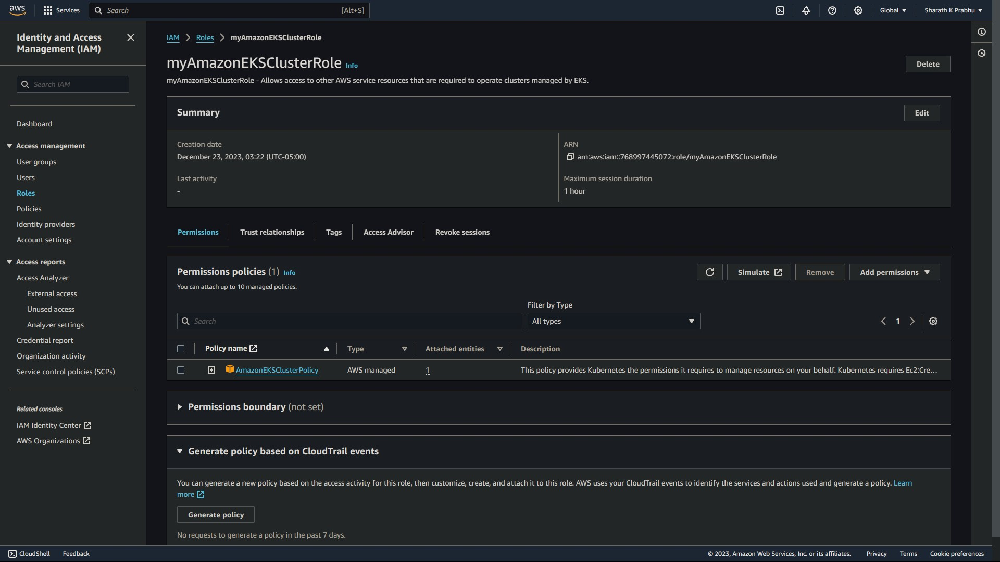
</p>

3. **Create** _**EKSAccess**_ **IAM Role :**
   - Similarly, create another role to provide EC2 instances to communicate with the EKS Cluster.

   - After creation it will look as follows:

<br>
<p align="center">
  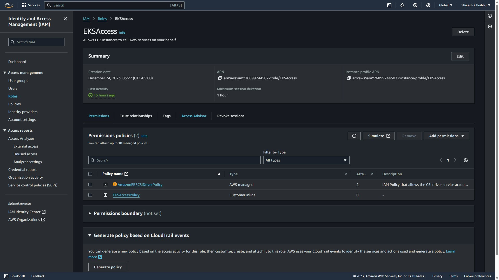
</p>

4. **Create an _**AmazonEKSNodeRole**_ :**
   - Follow the steps mentioned in this __[documentation](https://docs.aws.amazon.com/eks/latest/userguide/service_IAM_role.html)__ using your root user.
   
   - Please note that you do NOT need to configure any VPC CNI policy mentioned after step 5.e under Creating the Amazon EKS node IAM role

   - Simply attach the following policies to your role once you have created:
     - **AmazonEKS_CNI_Policy**
     - **AmazonEBSCSIDriverPolicy**
     - **AmazonEC2ContainerRegistryReadOnly**
     - **AmazonECKSWorkerNodePolicy**
   
   - After creation it will look as follows: 

  <br>
  <p align="center">
    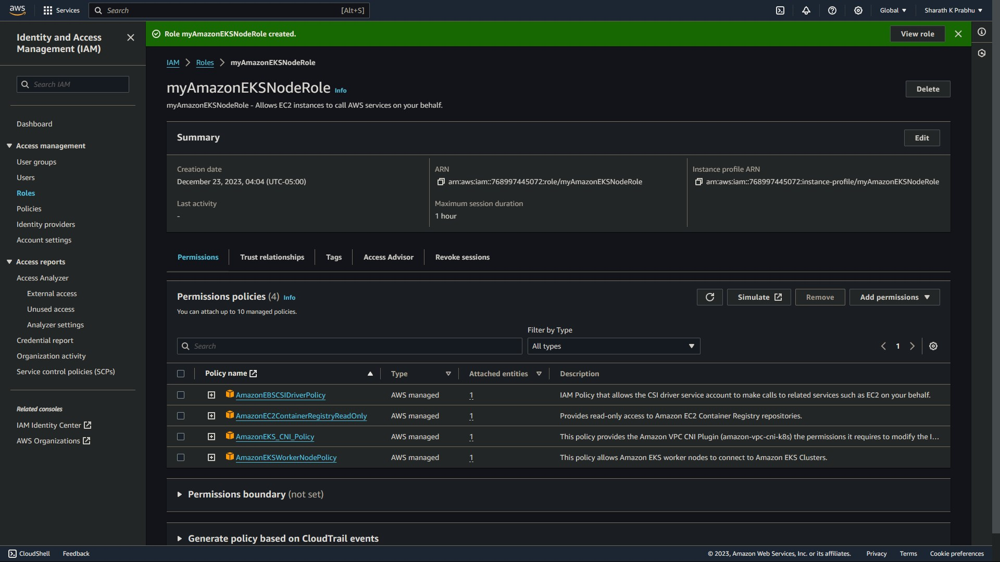
  </p>

5. **Create an EKS Cluster :**

   1. **Open EKS Dashboard:**
      - Navigate to the Amazon EKS service from the AWS Console dashboard.

   2. **Create EKS Cluster:**
      - Click "Create cluster."
      - Choose a name for your cluster.
      - Configure networking settings (VPC, subnets).
      - Choose the `EKSCluster` IAM role that was created above
      - Review and create the cluster.

   3. **Cluster Creation:**
      - Wait for the cluster to provision, which may take several minutes.

   4. **Cluster Ready:**
      - Once the cluster status shows as "__Active__" you can now create node groups.

  <br>
  <p align="center">
    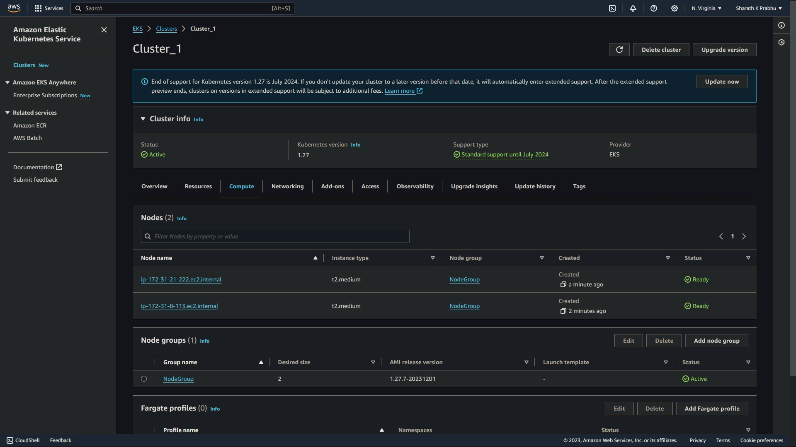
  </p>

6. **Create Node Groups:**

   1. In the "__Compute__" section, click on "__Add node group__".

   2. Choose the default AMI (__Amazon Linux 2__), instance type (e.g., __t2.medium__), and set the number of nodes to 2.

  <br>
  <p align="center">
    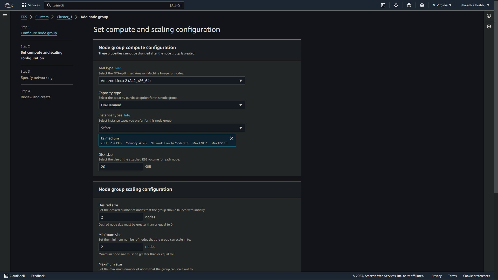
  </p>

  <p align="center">
    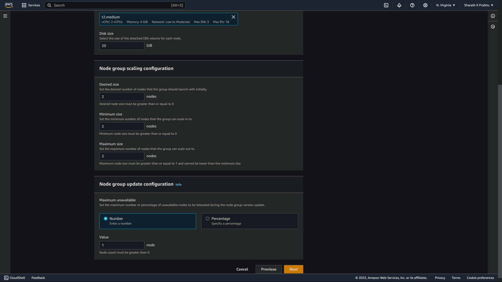
  </p>

   3. Click "__Create__".

   <br>
   <p align="center">
    
   </p>

7. **Enable EBS CSI Addon:**

    Add an additional add-on __EBS CSI__. This enables _Persistent Volume Claims_ once cluster is created.

<br>
<p align="center">
  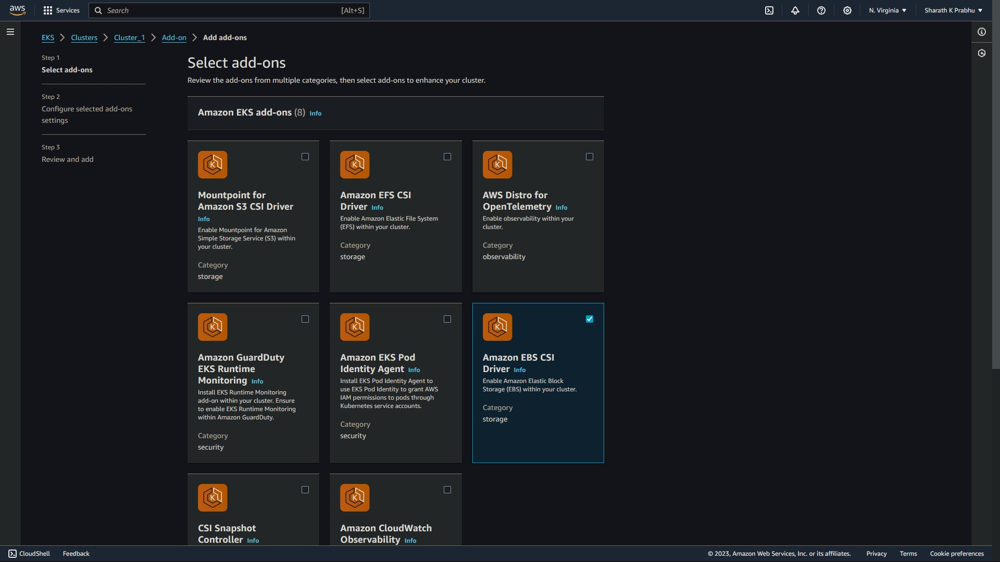
</p>

**NOTE:** Ensure that all the necessary ports are open in the node security group by allowing all the __Inbound Rules__ and __Outbound Rules__ for your network.

<br>

8. **Configuring your EC2 instance:**

    The EC2 instance requires the basic components to operate and communicate with EKS.

    1. Install `kubectl`.

        ```
        curl -O https://s3.us-west-2.amazonaws.com/amazon-eks/1.24.11/2023-03-17/bin/linux/amd64/kubectl
        chmod +x ./kubectl
        sudo cp ./kubectl /usr/local/bin
        export PATH=/usr/local/bin:$PATH
        ```

    2. Install `git`.

        ```
        sudo yum install git -y
        ```

    3. Install `aws cli`.

        ```
        curl "https://awscli.amazonaws.com/awscli-exe-linux-x86_64.zip" -o "awscliv2.zip"
        unzip awscliv2.zip
        sudo ./aws/install
        ```

    4. Clone this repository.

        ```
        git clone https://github.com/maxlr8/aws_eks_cloud_native_app.git
        ```

    5. Change the default path to `manifests` dir for further setup.

        ```
        cd ./eks_cloud_native_voting_app/manifests
        ```

<br>

  This finishes the basic configuration with the EC2 instance.

<br>

9. **Configure `kubectl` to communicate with `AWS`:**

    Once the EKS Cluster is __Active__ with the Node Group running, you will see 2 additional instances of EC2 running apart from your main instance as a part of replication set.

    If so, connect to the EC2 instance you just created.

    <br>
    <p align="center">
      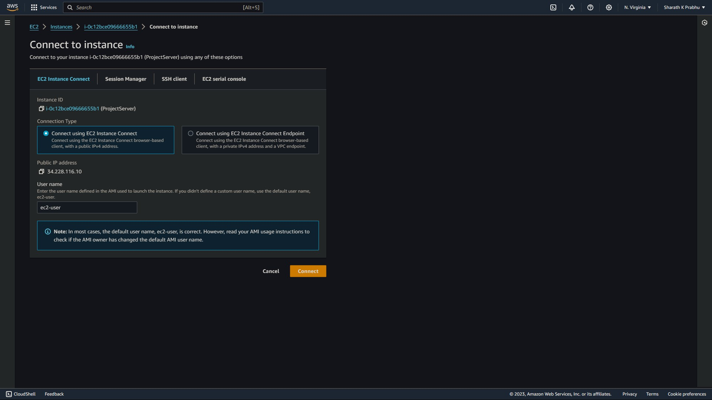
    </p>

    1. Set the context of `kubectl`.

        ```
        aws eks update-kubeconfig --name <EKS_CLUSTER_NAME> --region <YOUR_AWS_REGION>
        ```

    2. Check the running nodes in your cluster.

        ```
        kubectl get nodes
        ```
        <br>
        <p align="center">
          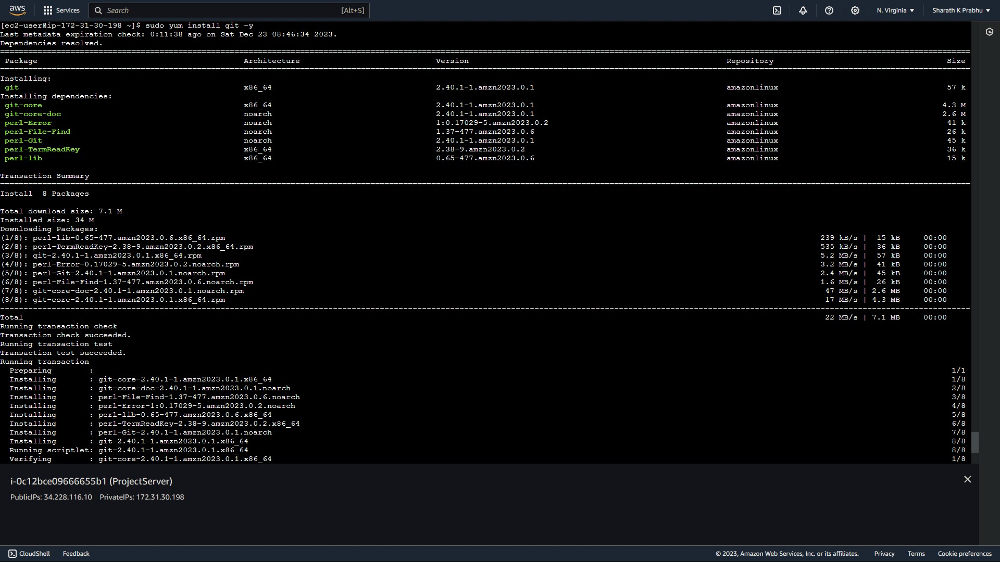
        </p>

        _If you are able to see the running node, then jump to Step - 10. If not, you will have to configure your `kubectl` as follows_

         * Open your `aws cloud cli`.

         * Run the previous commands and see the output. If the `kubectl` is able to run fine, it shows that the AWS IAM user that has logged into the EC2 instance you are using is not mapped with `kubectl`.

         * So, we will have to map the user by editing the config map of the EKS in the `kube-system` namespace by running the command `kubectl edit configmap aws-auth -n kube-system`

            <br>
            <p align="center">
              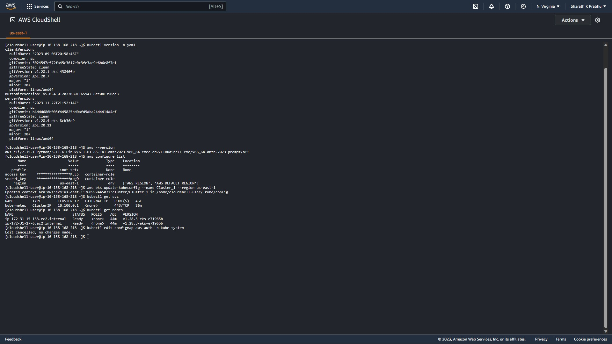
            </p>

          * Add the `role arn` value of EKSAccess and set the `username` as __EKSAccess__. Provide the groups value as shown in the picture. <br><br> __NOTE:__ _Maintain the indentation as shown. Else the configuration won't work._

            <br>
            <p align="center">
              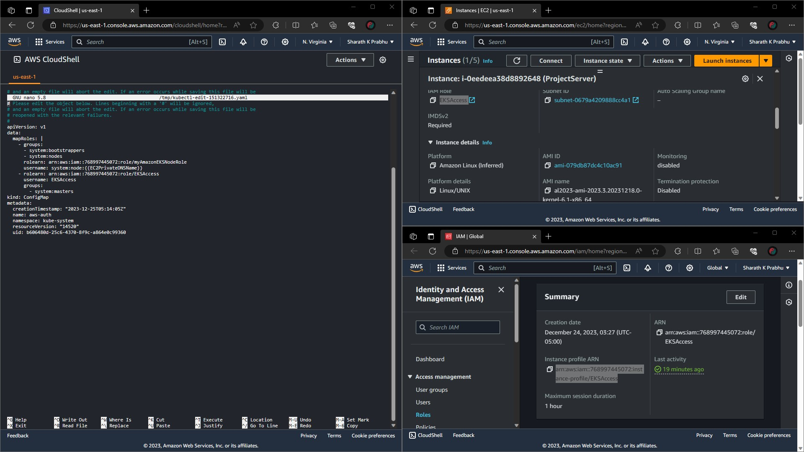
            </p>

         * In case if you are not the creator of the EKS cluster, follow this __[AWS DOC](https://repost.aws/knowledge-center/eks-api-server-unauthorized-error)__ for resolution.

    <br>

    __*This finishes the basic configuration with the instance.*__

  <br>

10. **Create and set a new default namespace:**

    Create a new namespace called `CloudChamp`

    ```
    kubectl create ns cloudchamp

    kubectl config set-context --current --namespace cloudchamp
    ```

<br>

11. **Setting up the `Mongo Database`:**

    Create stateful set with persistent volumes for the Mongo DB.

    ```
    kubectl apply -f mongo-statefulset.yaml
    ```
    <br>

    Create a headless service for Mongo DB for Load-Balancing and Network Routing within it's instances.

    ```
    kubectl apply -f mongo-service.yaml
    ```
    <br>

    Create a temporary network utils pod and check if the services have a DNS name created within the cluster, one per pod. 

    ```
    kubectl run --rm utils -it --image praqma/network-multitool -- bash
    ```
    <br>

    Enters into a bash session within the utils container. Upon entering run the command to list all the DNS values.

    ```
    for i in {0..2}; do nslookup mongo-$i.mongo; done
    ```

    __NOTE:__ _If DNS names are output, it confirms that the DNS records have been created successfully._
    <br><br>

    Once done, exit.

    ```
    exit
    ```
    <br>

    Initialize Mongo DB replica set on the `mongo-0` pod.

    ```
    cat << EOF | kubectl exec -it mongo-0 -- mongo
    rs.initiate();
    sleep(2000);
    rs.add("mongo-1.mongo:27017");
    sleep(2000);
    rs.add("mongo-2.mongo:27017");
    sleep(2000);
    cfg = rs.conf();
    cfg.members[0].host = "mongo-0.mongo:27017";
    rs.reconfig(cfg, {force: true});
    sleep(5000);
    EOF
    ```
    <br>

    Confirm this by running the below command to see `one PRIMARY pod` and `2 SECONDARY pods`.

    ```
    kubectl exec -it mongo-0 -- mongo --eval "rs.status()" | grep "PRIMARY\|SECONDARY"
    ```

    <br>
    <p align="center">
      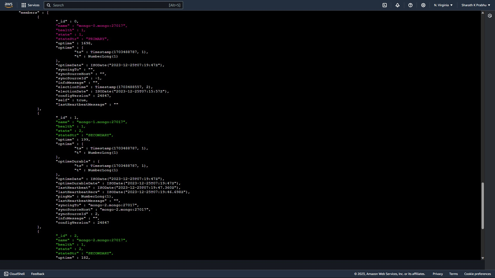
    </p>

    <br>

    __Loading data into the database__

    Run the following command to load the language data with their rank and other different attributes.

    ```
    cat << EOF | kubectl exec -it mongo-0 -- mongo
    use langdb;

    db.languages.insert({"name" : "csharp", "codedetail" : { "usecase" : "system, web, server-side", "rank" : 5, "compiled" : false, "homepage" : "https://dotnet.microsoft.com/learn/csharp", "download" : "https://dotnet.microsoft.com/download/", "votes" : 0}});
    db.languages.insert({"name" : "python", "codedetail" : { "usecase" : "system, web, server-side", "rank" : 3, "script" : false, "homepage" : "https://www.python.org/", "download" : "https://www.python.org/downloads/", "votes" : 0}});
    db.languages.insert({"name" : "javascript", "codedetail" : { "usecase" : "web, client-side", "rank" : 7, "script" : false, "homepage" : "https://en.wikipedia.org/wiki/JavaScript", "download" : "n/a", "votes" : 0}});
    db.languages.insert({"name" : "go", "codedetail" : { "usecase" : "system, web, server-side", "rank" : 12, "compiled" : true, "homepage" : "https://golang.org", "download" : "https://golang.org/dl/", "votes" : 0}});
    db.languages.insert({"name" : "java", "codedetail" : { "usecase" : "system, web, server-side", "rank" : 1, "compiled" : true, "homepage" : "https://www.java.com/en/", "download" : "https://www.java.com/en/download/", "votes" : 0}});
    db.languages.insert({"name" : "nodejs", "codedetail" : { "usecase" : "system, web, server-side", "rank" : 20, "script" : false, "homepage" : "https://nodejs.org/en/", "download" : "https://nodejs.org/en/download/", "votes" : 0}});

    db.languages.find().pretty();
    EOF
    ```
    <br>

    <p align="center">
      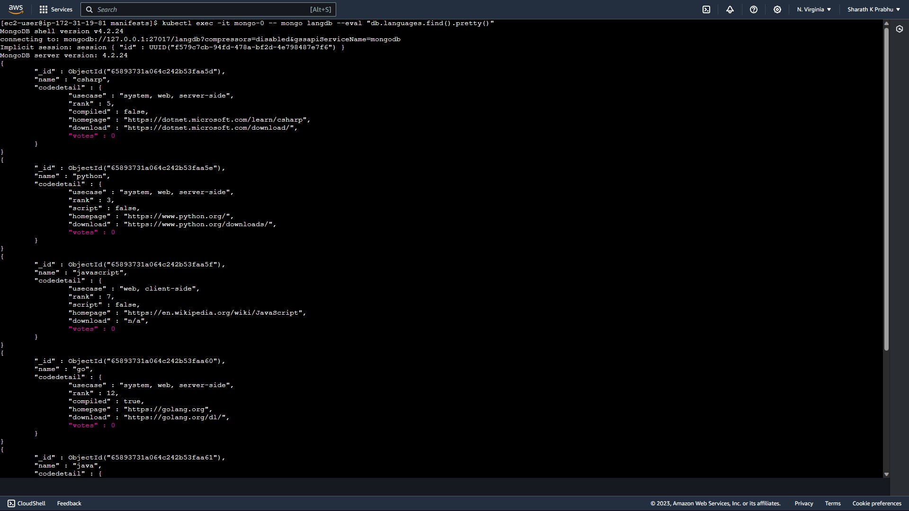
    </p>
    <br>

    Create a Mongo secret to store user credentials for the database.

    ```
    kubectl apply -f mongo-secret.yaml
    ```

<br>

12. **`GO API` Setup:**

    Create a API deployment resource for __GO API__.   

    ```
    kubectl apply -f api-deployment.yaml
    ```
    <br>

    Expose the `API` deployment to the external network through service that is Load-Balanced.

    ```
    kubectl expose deploy api \
    --name=api \
    --type=LoadBalancer \
    --port=80 \
    --target-port=8080
    ```
    <br>

    Set the environment variable to get the assigned DNS.

    ```
    {
    API_ELB_PUBLIC_FQDN=$(kubectl get svc api -ojsonpath="{.status.loadBalancer.ingress[0].hostname}")
    until nslookup $API_ELB_PUBLIC_FQDN >/dev/null 2>&1; do sleep 2 && echo waiting for DNS to propagate...; done
    curl $API_ELB_PUBLIC_FQDN/ok
    echo
    }
    ```
    <br>

    <p align="center">
      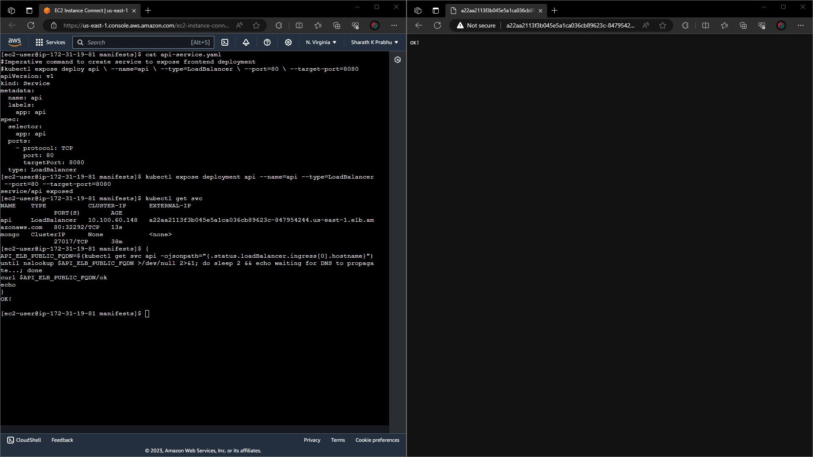
    </p>
    <br>

    Test the routes `<DNS Value>/languages` and `<DNS Value>/languages/{name}` endpoints can be accessible and working.

    <br>

    Run the following commands one-by-one to see the output in the terminal.

    ```
    curl -s $API_ELB_PUBLIC_FQDN/languages | jq .
    curl -s $API_ELB_PUBLIC_FQDN/languages/go | jq .
    curl -s $API_ELB_PUBLIC_FQDN/languages/java | jq .
    curl -s $API_ELB_PUBLIC_FQDN/languages/nodejs | jq .
    ```
    <br>

    <p align="center">
      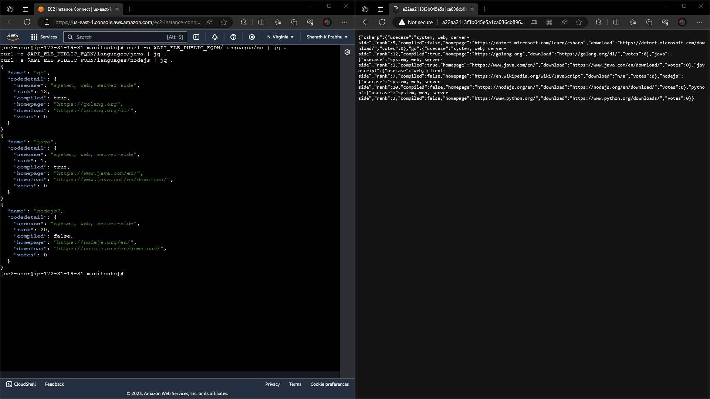
    </p>
    <br>

13. **Set up the `Frontend`:**

    Create a deployment resource for the __frontend__ setup.

    ```
    kubectl apply -f frontend-deployment.yaml
    ```
    <br>

    Create a service resource of the type Load-Balancer.

    ```
    kubectl expose deploy frontend \
    --name=frontend \
    --type=LoadBalancer \
    --port=80 \
    --target-port=8080
    ```
    <br>

    Confirm that the `frontend ELB` is ready to receive HTTP traffic.

    ```
    {
    FRONTEND_ELB_PUBLIC_FQDN=$(kubectl get svc frontend -ojsonpath="{.status.loadBalancer.ingress[0].hostname}")
    until nslookup $FRONTEND_ELB_PUBLIC_FQDN >/dev/null 2>&1; do sleep 2 && echo waiting for DNS to propagate...; done
    curl -I $FRONTEND_ELB_PUBLIC_FQDN
    }
    ```

    Get the `frontend URL` for browsing.

    ```
    echo http://$FRONTEND_ELB_PUBLIC_FQDN
    ```
    <br>

    <p align="center">
      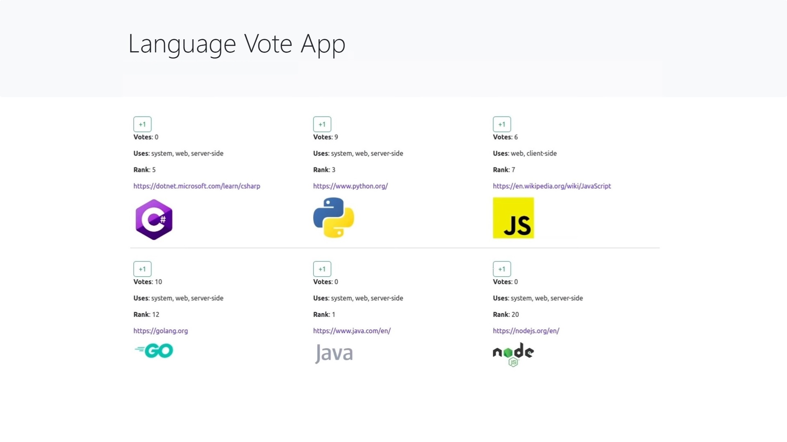
    </p>
    <br>

    Check the _updated votes_ at the backend on the terminal from the `Mongo DB`.

    ```
    kubectl exec -t mongo -it mongo-0 -- mongo langdb --eval "db.languages.find().pretty()"
    ```
    <br>

## __Destroying the Infrastructure__

To clean up the infrastructure, follow these steps:

1. **Terminate your EC2 instances:** Terminate all your EC2 instances (main and replica).

2. **Delete the Node Group:** Delete the node group associated with your EKS cluster.

3. **Delete the EKS Cluster:** Once the nodes are deleted, you can proceed to delete the EKS cluster itself.